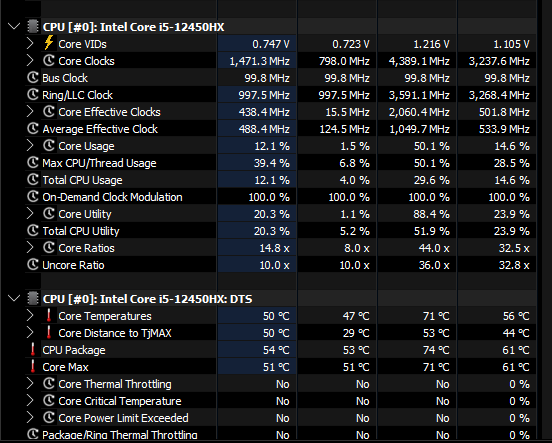
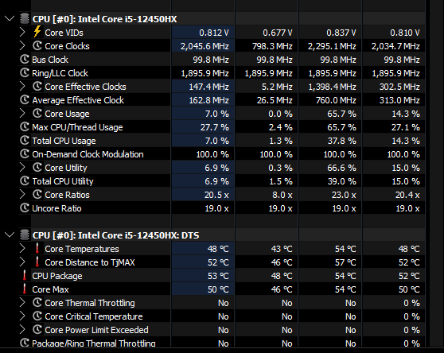

# RustGovernor (v1.0.0)
 
An ultra-lightweight Windows power governor designed to kill fan noise and keep high-performance laptops cool during daily tasks.

I built this because Windows "Balanced" and "Performance" modes are often too aggressive—spiking voltages and clocks for simple tasks like web browsing, which leads to unnecessary heat and loud fans.

The online tools just had too many sliders to manage and also a UI or require manual control or just requiure the GUI to be open. Mine just works and can deliver on-demand performance if needed.

**RustGovernor** uses a "Cool-First" logic: it keeps the CPU efficient and silent during 0-50% load and only unleashes full power (Turbo Boost) when you actually floor it.

It works by taking average load of the cpu and using it to do its logic preventing any of that immediate cpu changes just cause the cpu usage dropped by 1 percent

it creates a config.txt in its directory where its binary is located which you can edit to create a more custom granular curve if you'd like.

---

## The Results (Real-World Test)
Tested on a **Lenovo LOQ 15IAX9** (i5-12450HX, RTX 3050) while browsing in Firefox.

| Metric | Windows Default (Balanced) | RustGovernor | **Improvement** |
| :--- | :--- | :--- | :--- |
| **Peak CPU Temp** | 74°C | **54°C** | **-20°C Cooler** |
| **Average Temp** | 61°C | **52°C** | **-9°C Cooler** |
| **Peak Voltage** | 1.216V | **0.837V** | **Lower Power Draw** |
| **Max Clock Speed** | 4.38 MHz | **2.29 MHz** | **Silent Operation** |
| **Acoustics** | Fans Ramping Up | **Dead Silent** | **Peace of Mind** |

### Visual Proof (HWInfo Data)

#### 1. Windows Default Behavior (Spiky & Hot)


*Notice the 1.21V spikes and the 74°C peak—totally unnecessary for just browsing.*

#### 2. RustGovernor Behavior (Stable & Cool)


*Voltage is capped at 0.83V, and the temperature stays in the low 50s. The fans never even turned on.*

---

## Elite Performance
*   **Binary Size:** 923 KB (No bloat)
*   **RAM Usage:** < 1.0 MB
*   **CPU Usage:** ~0% (Written in pure Rust)
*   **Admin-Ready:** Installs as a Windows Task (Highest Privileges) to handle power schemes without UAC popups at every boot.

## 🛠️ Installation
1. Download the `rust-governor.exe`.
2. Open a terminal as Administrator.
3. Run `rust-governor --install`.
4. It will now start automatically at boot (hidden in the background).

## 📊 Monitoring
To see exactly what the governor is doing in real-time:
```bash
rust-governor --monitor
```

---

## ⚖️ License
MIT - This is just a program I made on the side do whatever you want with it.
